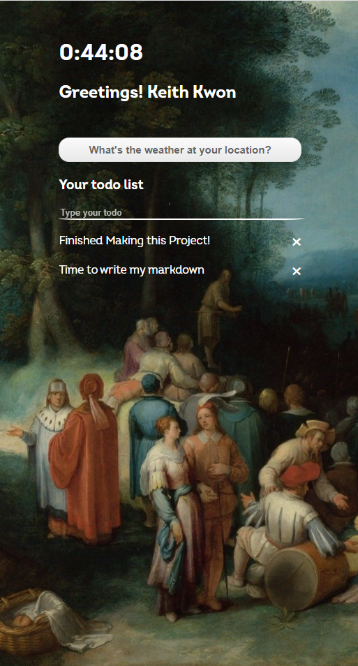
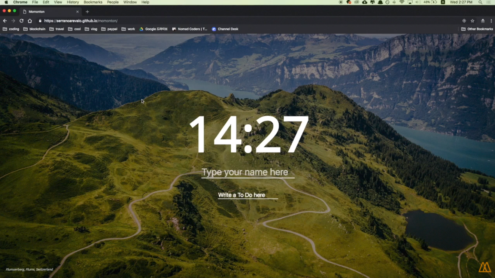
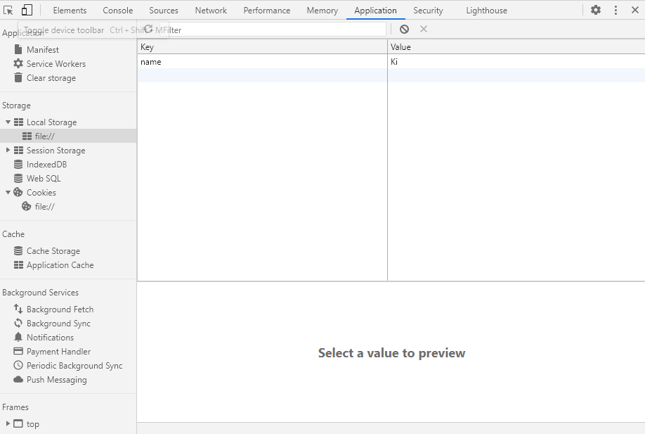
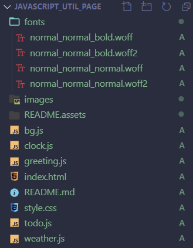

# Javascript Homepage

> Mixup of 'Nomad Coders Javascript Chrome app' and my inspiration from 'Comme des Garcons' homepage.
> Javascript functionalities are from the former while the background design aspect is from the latter.
> Background slide function is not implemented.


### Finished Screenshot





[Comme des Garcons](https://www.comme-des-garcons.com/index.html)



[Nomad Coders](https://nomadcoders.co/javascript-for-beginners/lobby)


Functions

- Time display
- Changing background
- Localsaved username and greetings
- Localsaved todo list
- Get weather using current location and weathe api


---


## 1. Time Display #Date() #inline if else #setInterval()

### Flow

1. Get current time using `Date()` function

   ```javascript
     const date = new Date();
     const hours = date.getHours();
     const minutes = date.getMinutes();
   ```

   

2. Change html using `.innerHTML` and **inline if else statement**.

   ```javascript
     clockTitle.innerHTML = `${hours}:${
       minutes < 10 ? `0${minutes}` : `${minutes}`
     }:${seconds < 10 ? `0${seconds}` : `${seconds}`}.${miliseconds}`;
   }
   ```

   

3. repeat using `setInterval()`

   ```javascript
   setInterval(getTime, 1);
   // repeats getTime() function every 1milisecond
   ```


### Note

1. Important that function inside `setInterval` does not include ().
2. Inline if else goes like this : `condition ? if true : if false`
3. Is there a way to implement flow no.2 without if else statements?

---


## 2. Background-image

> Wanted to make a full-screen / responsive background-image in the style of comme des garcons homepage. Minimalistic, mysterious and aesthetic layout is hard to forget. The actual homepage contains slide function. The size of the background image seemed to be decided when opening the homepage. Thus, if I readjusted my browser size, the background image would not be responsive, but if I reloaded the page, it would fit. My implementation did not include the slide function but selects randomly from 5 different images and is responsive to changing browser size, maintaining full cover and center position.


### Flow

1. Generate random number to select random images.

   ```javascript
   Math.floor(Math.random() * (to - from)) + from;
   ```

2. Set backgroundImage to body

   ```javascript
   body.style.backgroundImage = `url(./images/${fileNameInput})`;
   ```

3. CSS styling

   ```css
   .bgImage {
     background-repeat: no-repeat;
     background-size: cover;
     background-attachment: fixed;
     background-position: 50% 50%;
   }
   ```


### Note

1. CSS styling was very difficult due to different values for the `background-size` property.

2. Very interesting idea was to make a div twice the size the browser

   ```html
   <div id="bg">
     
   </div>
   ```

   ```css
   #bg {
     position: fixed; 
     top: -50%; 
     left: -50%; 
     width: 200%; 
     height: 200%;
   }
   #bg img {
     position: absolute; 
     top: 0; 
     left: 0; 
     right: 0; 
     bottom: 0; 
     margin: auto; 
     min-width: 50%;
     min-height: 50%;
   }
   ```

3.  This seems to be how the slide show in the original home page works. Should try later.


---


## 3. Greetings #localStorage #class toggle #preventDefault

### Flow

1. Check localstorage if name is already saved.

   ```js
   const name = localStorage.getItem("name");
   ```

   

2. If true : showname

3. Else : ask for name via input.value. Must inlcude preventDefault() to stop refreshing

   ```js
     input.addEventListener("keypress", function (e) {
       if (e.key === "Enter") {
         e.preventDefault();
         const name = input.value;
         localStorage.setItem("name", name);
         showName(name);
       }
   ```

   

4. Save input to localStorage

5. Show name and hide input by toggling class

   ```js
     nameplace.innerHTML = "Greetings! " + name;
     nameplace.classList.toggle("hide");
     input.classList.toggle("hide");
   ```

   


### Notes

1. What is localStorage? How is it different to cookies? 

   > Before HTML5, application data had to be stored in cookies, included in every server request. Web storage is more secure, and large amounts of data can be stored locally, without affecting website performance.
   >
   > Unlike cookies, the storage limit is far larger (at least 5MB) and information is never transferred to the server.
   >
   > Web storage is per origin (per domain and protocol). All pages, from one origin, can store and access the same data.
   >
   > [also look](https://ko.javascript.info/localstorage)

   

2. Must learn principles of how to divide into multiple functions.

3. Nicholas places input inside form. Then adds **eventlistener to form**, and picks the value from input.value. 

4. Very useful event: submit

   > Note that the `submit` event fires on the `<form>` element itself, and not on any `button` or `input` inside it. However, the [`SubmitEvent`](https://developer.mozilla.org/en-US/docs/Web/API/SubmitEvent) which is sent to indicate the form's submit action has been triggered includes a [`submitter`](https://developer.mozilla.org/en-US/docs/Web/API/SubmitEvent/submitter) property, which is the button that was invoked to trigger the submit request.
   >
   > The `submit` event fires when the user clicks a submit button or presses Enter while editing a field  in a form. The event is not sent to the form when calling the [`form.submit()`](https://developer.mozilla.org/en-US/docs/Web/API/HTMLFormElement/submit) method directly.

   


## 4. Todo list #createElement #filter #localStorage #parse #stringify #forEach

### Flow

>CRD is implemented using localstorage in this section. So it was much difficult then originally thought.
>
>

```js
const todoForm = document.querySelector(".js-todoForm");
const todoInput = todoForm.querySelector("input");
const todoList = document.querySelector(".js-todoList");
const TODOS_LS = "todos";
let todos = [];
let ID = 0;
```


1. Load todos if we have one

   ```js
   function loadTodos() {
     const loadedTodos = localStorage.getItem(TODOS_LS);
     if (loadedTodos) {
       const parsedLoad = JSON.parse(loadedTodos);
       parsedLoad.forEach(function (todo) {
         paintTodo(todo.text, todo.id);
       });
     }
   }
   
   ```

2. Show loaded todos

   ```js
   function paintTodo(text, number) {
     const li = document.createElement("li");
     const delBtn = document.createElement("span");
     delBtn.innerText = "✖";
     delBtn.addEventListener("click", delTodo);
     const span = document.createElement("span");
     span.innerText = text;
     li.appendChild(span);
     li.appendChild(delBtn);
     li.id = number;
     todoList.appendChild(li);
     const todoObj = {
       text: text,
       id: number,
     };
     if (number >= ID) {
       ID++;
     }
     localStorage.setItem("ID", ID);
     todos.push(todoObj);
     saveTodos();
   }
   
   ```

3. Create todo

   ```js
   function handleSubmit(event) {
     event.preventDefault();
     const currentValue = todoInput.value;
     paintTodo(currentValue, ID); //back to upper function
     todoInput.value = "";
   }
   
   ```

   ```js
   function saveTodos() {
     localStorage.setItem(TODOS_LS, JSON.stringify(todos));
   }
   ```

4. Delete todo

   ```js
   function delTodo(event) {
     const li = event.target.parentElement;
     console.log(li.id);
     const cleanTodos = todos.filter(function (todo) {
       return todo.id != li.id;
     });
     todoList.removeChild(li);
     todos = cleanTodos;
     saveTodos();
   }
   ```

   


### Note #stringify #parsing #serialization #js function naming convention #js file naming convention  

1. js function naming convention

   > - Variable name is always camel case and should begin with a noun;
   > - Functions name should begin with a verb.
   > - Make the variable name as short as possible.
   > - A single-character variable name such as `i`, `j`, `k` are typically reserved for use in loops.

2. js file naming convention

   > product-name.plugin-version.fileype.js

3. js variable naming convention

   > - A global **JavaScript variable** is declared at the top of a project/file.
   > - A global **JavaScript variable** is written in camelCase if it is mutable.
   > - A global **JavaScript variable** is written in UPPERCASE if it is immutable.

3. JSON stringify vs parsing vs serialization

4. Class and ID naming convention

   > Always favor lowercase, for elements, for attributes and their values, for classes and ids. Multi-word names for classes and ids should either 1., concatenate the words in lowercase without any in-between character, or 2., separate each word with a "-" (not "_") and maintain lowercasing throughout.
   >
   > ex)
   >
   > class="importantreminder"
   >
   > class="important-reminder"

5. innerText vs innerHTML vs value

6. created id value that keeps on going up. Nicholas only used length of array, but that will cause duplicate IDs in case items were deleted. This is a way to make the id value keep going up.

   ```js
   function loadId() {
     ID = localStorage.getItem("ID");
     if (ID === null) {
       ID = 0;
     }
   ```

   

## Weather #api #location #fetch #geolocation

### Flow

1. When btn clicked, check if coordinate is saved in localStorage. If yes, getWeather. Else, askCoords()

2. ask coords

   ```js
   navigator.geolocation.getCurrentPosition(handleGeoSuccess, handleGeoError);
   ```

3. Save coords

   ```js
   localStorage.setItem(COORDS, JSON.stringify(coordsObj));
   ```

   

4. Get weather by api

   ```js
   function getWeather() {
     const currentPosition = JSON.parse(localStorage.getItem(COORDS));
     fetch(
       `https://api.openweathermap.org/data/2.5/weather?lat=${currentPosition.lat}&lon=${currentPosition.lon}&appid=${APIkey}&units=metric`
     )
       .then((response) => {
         return response.json();
       })
       .then((json) => {
         const weather = json;
         const description = weather.weather[0].description;
         const temp = weather.main.temp;
         const feels_like = weather.main.feels_like;
         weatherPar1.innerHTML = `Currently ${description}`;
         weatherPar2.innerHTML = `Temperature is ${temp}C and feels like ${feels_like}C`;
       });
   }
   ```

   

### Note #fetch

1. Fetch vs axios. How is it different?
2. How to hide API keys while using vanilaJS? .envs are only for node?
3. What options do I have in navigator


## Styling and Custom Font #woff #font

### Custom Font

```css
@font-face {
  font-family: "Intro";
  src: url("fonts/normal_normal_normal.woff2") format("woff2");
}

@font-face {
  font-family: "Intro";
  src: url("fonts/normal_normal_bold.woff2") format("woff2");
  font-weight: bold;
}

body {
  font-family: Intro;
}

```




### Some CSS Stylings

- ul has default `padding-inline-start`. This had to be set to 0 for my purpose.

```css
ul {
  padding-inline-start: 0;
}

```

- Prettier input 

  ```css
  input {
    display: flex;
    background-color: transparent;
    color: white;
    width: 100%;
    border-color: white;
    border-width: 1px;
    border-radius: 10%;
    border: 0;
    border-bottom: 2px solid white;
  }
  
  input:focus {
    outline: none;
  }
  
  ::placeholder {
    color: white;
    opacity: 0.7;
  }
  ```

  


- Amazing buttons can be found [here](https://www.bestcssbuttongenerator.com/#/28)

  ```css
  .weather-btn {
    margin-top: 30px;
    box-shadow: inset 0px 1px 0px 0px #ffffff;
    background: linear-gradient(to bottom, #f9f9f9 5%, #e9e9e9 100%);
    background-color: #f9f9f9;
    border-radius: 15px;
    border: 1px solid #dcdcdc;
    display: inline-block;
    cursor: pointer;
    color: #666666;
  
    font-family: Arial;
    font-size: 15px;
    font-weight: bold;
    padding: 8px 42px;
    text-decoration: none;
    text-shadow: 0px 1px 0px #ffffff;
  }
  .weather-btn:hover {
    background: linear-gradient(to bottom, #e9e9e9 5%, #f9f9f9 100%);
    background-color: #e9e9e9;
  }
  .weather-btn:active {
    position: relative;
    top: 1px;
  }
  ```

  


### Note

1. woff vs woff2 and other font related knowledges

 